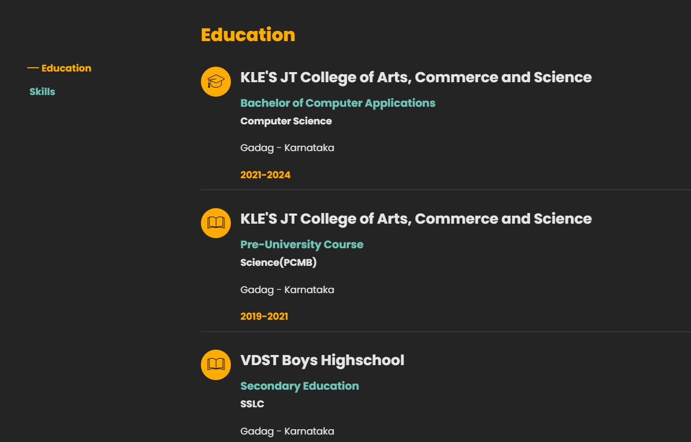
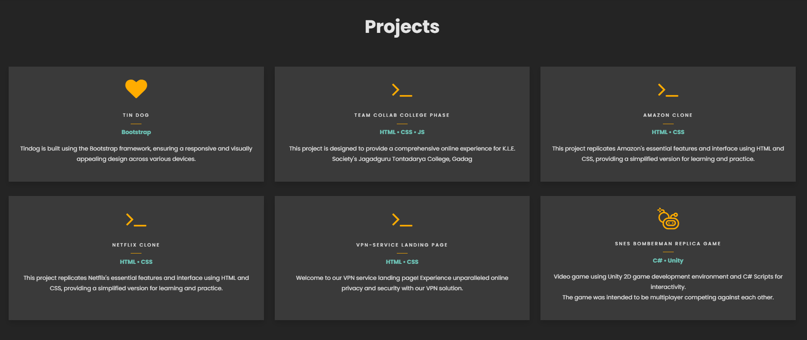

# My Portfolio
Welcome to my portfolio repository! This repository contains the source code for my personal portfolio website

## Demo
Explore the full portfolio [here](https://sangameshpk-2003.github.io/Portfolio/)

## Table of Contents
- [Introduction](#introduction)
- [Features](#features)
- [Technologies Used](#technologies-used)
- [Usage](#usage)
- [Screenshots](#screenshots)
- [Contact](#contact)

## Introduction
This is my personal portfolio website where I showcase my skills, projects, and experiences. It includes sections such as About Me, Projects, Skills, Contact, and more.

## Features

- Responsive design
- Interactive UI/UX
- Dynamic project showcase
- Contact form with email integration
- Social media links

## Technologies Used

- HTML
- CSS
- JavaScript

## Usage

Navigate through the different sections to learn more about me and my work. Feel free to contact me through the contact form on the website.

## Screenshots

## Contact

You can reach me at:
- Email: kardegoudasangamesh@gmail.com
- LinkedIn: [Sangamesh Kardegouda](https://www.linkedin.com/in/sangamesh-kardegouda-ab3751280/)
- Twitter: [@S_P_Kardegouda](https://x.com/S_P_Kardegouda)
  

